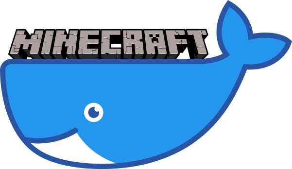

docker-minecraft
================

    

    
    
    
     
    
    
    
    

    Docker image for <a href="https://minecraft.net/">Minecraft</a> server.

---

Running the Container
---------------------

First create a named data volume to hold the persistent world and config data:

    docker volume create --name minecraft-data

Then run the Minecraft server:

    docker run -it -d -p 25565:25565 -v minecraft-data:/etc/minecraft --name minecraft-server phlak/minecraft

#### Optional 'docker run' Arguments

<dl>
    <dt><code>-e _JAVA_OPTIONS='-Xms256M -Xmx2048M'</code></dt>
    <dd>Set JVM arguments for minimum/maximum memory consumption (default: '-Xms256M -Xmx2048M')</dd>
</dl>

<dl>
    <dt><code>-e TZ=America/Phoenix</code></dt>
    <dd>Set the timezone for your server. You can find your timezone in this <a href="https://goo.gl/uy1J6q">list of timezones</a>. Use the (case sensitive) value from the <code>TZ</code> column. If left unset, timezone will be UTC.</dd>
</dl>

<dl>
    <dt><code>--restart unless-stopped</code></dt>
    <dd>Always restart the container regardless of the exit status, but do not start it on daemon startup if the container has been put to a stopped state before. See the Docker <a href="https://goo.gl/Y0dlDH">restart policies</a> for additional details.</dd>
</dl>

**NOTE:** See the [Minecraft Wiki](http://minecraft.gamepedia.com/Server/Requirements) for more info
on memory requirements.

Editing the Server Config
-------------------------

Once you have a running container, you can edit the Minecraft [server config](https://minecraft.gamepedia.com/Server.properties) with:

    docker exec -it minecraft-server vi /etc/minecraft/server.properties

After saving changes, restart your container with `docker restart minecraft-server`

Adding OPs
----------

Once you have a running server container you can add OPs by running:

    docker exec minecraft-server ops [PLAYER_NAMES]

**NOTE:** Replace `[PLAYER_NAMES]` with the name of one or more players you wish to give OP
privileges separated by a space. If a players name contains spaces wrap it in quotation marks.

Here's an example granting OP to three players with name's `Marty`, `Jennifer` and  `Doc Brown`:

    docker exec minecraft-server ops Marty Jennifer "Doc Brown"

Running Server Commands
-----------------------

You can run [commands](https://minecraft.gamepedia.com/Commands) on the server
(e.g. `kick`, `ban`, `say`, etc.) by attaching to the running container and
running the commands. Attach to the server by running:

    docker attach minecraft-server

Once attached you can run your commands like normal.

    say Hello world!
    [10:11:56] [Server thread/INFO]: [Server] Hello world!
    list
    [10:12:08] [Server thread/INFO]: There are 3 of a max 10 players online: Marty, Jennifer, Doc Brown
    seed
    [10:12:19] [Server thread/INFO]: Seed: [-5234790158571010769]

**NOTE:** In order to detach from the container and leave it running use the
`Ctrl + P` then `Ctrl + Q` key sequence.

Upgrading the Server
--------------------

First pull down the latest image:

    docker pull phlak/minecraft

Remove your running server container:

    docker rm -f minecraft-server

And run a new one with the same command/arguments as before.

Troubleshooting
---------------

For general help and support join our [Spectrum Community](https://spectrum.chat/phlaknet) or reach out on [Twitter](https://twitter.com/PHLAK).

Please report bugs to the [GitHub Issue Tracker](https://github.com/PHLAK/docker-minecraft/issues).

Copyright
---------

This project is licensed under the [MIT License](https://github.com/PHLAK/docker-minecraft/blob/master/LICENSE).
